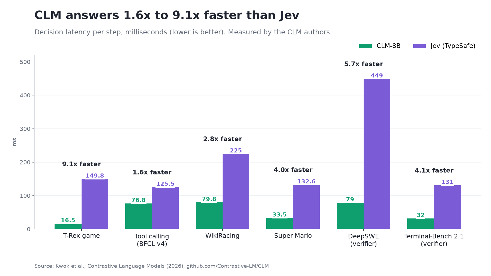
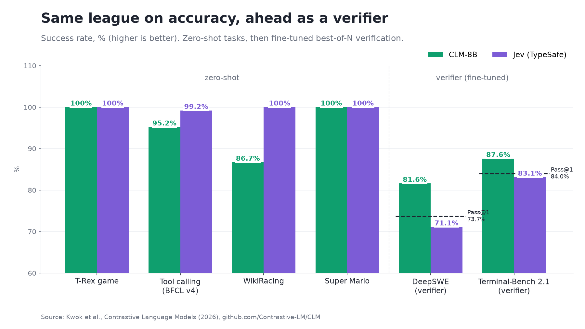

# CLM Voice Showcase

A live single-page demo. Each caller turn of a clinic voice agent goes to three models **in parallel**, and each makes the same four decisions (turn ended?, which tool, frustration, escalate?):

| Lane | Backend call |
|---|---|
| Normal LLM | OpenAI chat completions with a strict JSON schema |
| Jev | `POST api.typesafe.ai/v1/systemone` (`jev-latest`) |
| CLM-8B | `POST <CLM_BASE_URL>/v1/systemone` (`clm-latest`, same request body as Jev) |

## Published benchmarks: CLM-8B vs Jev




CLM is 1.6x to 9.1x faster on every task. It ties or slightly trails Jev on zero-shot accuracy (BFCL 95.2% vs 99.2%, WikiRacing 26/30 vs 30/30) and leads as a fine-tuned verifier (DeepSWE 81.6% vs 71.1%, Terminal-Bench 2.1 87.6% vs 83.1%). These figures come from the [CLM authors](https://contrastive-lm.notion.site/) ([repo](https://github.com/Contrastive-LM/CLM)). The charts are regenerated by [docs/make_charts.py](docs/make_charts.py) (`pip install matplotlib`). Use this demo to measure the difference on your own traffic.

## The demo

Every latency shown is a measured round trip from the backend. Results stream to the UI as each lane finishes. The agent's spoken reply is driven by the lane you pick (CLM by default).

## 1. Put CLM on a free GPU

The CLM encoder is Qwen3-8B and needs a GPU (about 16 GB of weights). Pick one:

- **Modal (recommended):** the free plan includes $30/month of credit, the L4 runs in bf16, and you get a stable URL. It scales to zero when idle.
  ```bash
  pip install modal && modal setup
  modal secret create clm-api-key CLM_API_KEY=<random-string>
  modal deploy deploy/modal_clm.py
  ```
- **Kaggle (free, 2× T4):** see [deploy/KAGGLE.md](deploy/KAGGLE.md). The URL changes each session.

Open `<url>/health` once before a demo so the GPU is warm. The first cold start takes 1–3 minutes.

## 2. Backend

```bash
cd backend
python -m venv .venv && .venv/Scripts/pip install -r requirements.txt   # (bin/ on macOS/Linux)
cp .env.example .env    # fill OPENAI_API_KEY, TYPESAFE_API_KEY, CLM_BASE_URL, CLM_API_KEY
.venv/Scripts/python -m uvicorn app:app --port 8000
```

## 3. Frontend

```bash
cd frontend && npm install && npm run dev    # http://localhost:5173
```

Use Chrome or Edge for microphone input (Web Speech API). Typing and the preset lines work in any browser.

## What to show
1. **The call:** speak or click presets. Watch CLM answer first while the other lanes are still "thinking… caller hears silence".
2. **Tools slider:** raise it from 8 to 250 and send again. Jev and the LLM slow down with more options; CLM reuses its cached tool embeddings.
3. **Run live benchmark:** a real latency-vs-tool-count chart across all three lanes.
4. **Why CLM:** session KPIs computed from your own runs, plus the comparison table.

The header pills show each lane's status. A lane that isn't configured shows an error instead of fake numbers. If CLM points at the repo's mock encoder, the pill reads "MOCK encoder".

## Run our evaluation

`bench/eval_set.json` holds 40 labeled caller turns covering booking, rescheduling, cancelling, refills, billing, insurance, clinic info, small talk, emergencies and callers trailing off mid-sentence. `bench/run_eval.py` sends each turn to every configured lane at the same moment, with 8, 64 and 250 tools. It scores tool-routing, escalation and end-of-turn accuracy and records p50/p95 latency. Output goes to `bench/results/`: `summary.md`, `results.json` and two charts.

```bash
backend/.venv/Scripts/pip install matplotlib
backend/.venv/Scripts/python bench/run_eval.py   # reads keys from backend/.env (git-ignored)
```
